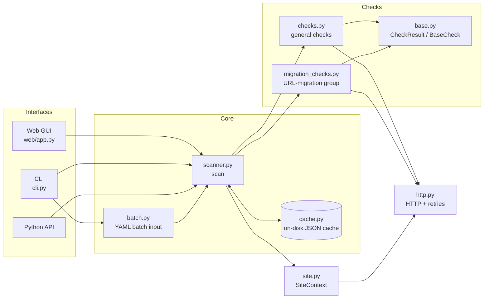
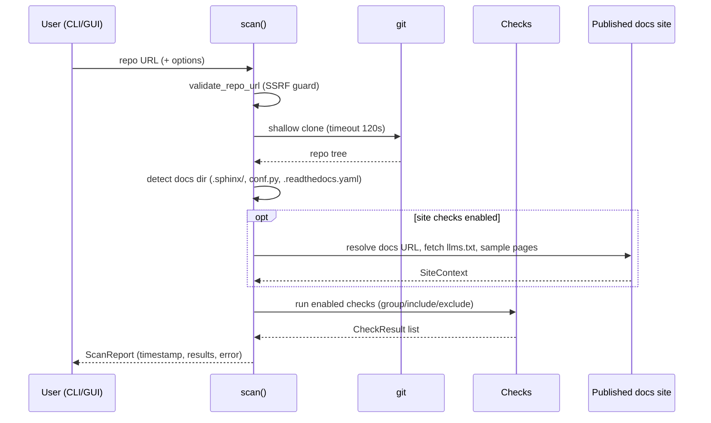

# Starter Pack Scanner

A CLI tool (with a local web GUI) to scan Git repositories that use [Canonical's Sphinx Stack](https://github.com/canonical/sphinx-stack) (ex. Starter Pack) and run a modular set of checks against them — including a dedicated **URL-migration validation** group for documentation migrated from Read the Docs hosting to Canonical domains.

## Architecture



Scan flow:



## Requirements

- Python 3.10+
- Git (available on `PATH`)

## Installation

The default install includes everything — the CLI **and** the web GUI:

```bash
cd starter-pack-scanner
pip install -e .
```

For a minimal, CLI-only install (e.g. in CI, where the web GUI dependencies
are unnecessary weight), use the `cli` extra:

```bash
pip install -e ".[cli]"
```

A `Makefile` is provided for common tasks (`make help` lists them all):

```bash
make install      # create .venv and install everything (CLI + web GUI)
make install-cli  # create .venv and install only the CLI dependencies
make run REPO=https://github.com/canonical/kafka-operator  # run the scanner
make serve-web    # start the web GUI at http://127.0.0.1:8765
make stop         # stop the web GUI if it's running in the background (alias: web-stop)
make test         # run the test suite (offline, no network needed)
make lint         # compile-check all sources
make clean        # remove build artifacts (keeps .venv)
```

## Usage

Scan a repository:

```bash
starter-pack-scanner https://github.com/canonical/kafka-operator
```

Scan a specific branch or tag:

```bash
starter-pack-scanner https://github.com/canonical/kafka-operator --branch main
```

List available checks:

```bash
starter-pack-scanner --list-checks
```

Run only specific checks:

```bash
starter-pack-scanner https://github.com/canonical/kafka-operator --check docs-dir version
```

Exclude specific checks:

```bash
starter-pack-scanner https://github.com/canonical/kafka-operator --exclude version
```

Skip all checks that need network access to the published docs site:

```bash
starter-pack-scanner https://github.com/canonical/kafka-operator --offline
```

Hide the "Fix:" guidance printed for failed checks (for terse CI logs):

```bash
starter-pack-scanner https://github.com/canonical/kafka-operator --no-recommendations
```

Override the published docs URL (auto-detected from `conf.py` otherwise):

```bash
starter-pack-scanner https://github.com/canonical/kafka-operator --docs-url https://canonical.com/data/kafka/docs/4/
```

Make the random page sampling reproducible:

```bash
starter-pack-scanner https://github.com/canonical/kafka-operator --seed 42
```

Extend the list of major documentation domains:

```bash
starter-pack-scanner https://github.com/canonical/kafka-operator --allow-domain example.com
```

Run only the URL-migration validation group:

```bash
starter-pack-scanner https://github.com/canonical/kafka-operator --group migration
```

Check that the pre-migration URL redirects to the new one (auto-derived from
`conf.py` git history when omitted):

```bash
starter-pack-scanner https://github.com/canonical/kafka-operator --group migration \
  --old-url https://canonical-example.readthedocs-hosted.com/
```

### Batch scanning

Scan multiple repositories from a YAML file (see [`batch-scan.yml`](batch-scan.yml) for a working example):

```bash
starter-pack-scanner --batch batch-scan.yml
```

**File format:**

```yaml
# Optional defaults applied to every entry (each entry can override):
defaults:
  branch: null          # default branch if unset
  docs_url: null        # auto-detect from conf.py if unset
  check_group: null     # e.g. "migration" to run only that group
  offline: false        # skip live-site checks
  exclude_checks: []    # check IDs to skip
  include_checks: []    # only run these check IDs

repos:
  # Plain URL shorthand:
  - https://github.com/canonical/kafka-operator

  # Full form with per-entry options:
  - repo: https://github.com/canonical/opensearch-operator
    docs_url: https://canonical.com/opensearch/docs/
    branch: main
```

Each entry under `repos` is either a plain URL string or a mapping with a
required `repo` key plus any of the options above. Unknown keys, invalid
URLs, unknown check groups, and YAML syntax errors are reported with precise
messages (exit code 2). Batch results are cached per entry like single scans.

In the web GUI, use the **Batch scan** tab and paste the YAML contents.

### Caching

Scan reports are cached on disk (one JSON file per scan configuration under
`~/.cache/starter-pack-scanner/`, honouring `XDG_CACHE_HOME`). Repeated scans
of the same repository are served from the cache instantly. Every report
shows the timestamp it was generated at.

- `--no-cache` — bypass the cache and run a fresh scan (the result replaces
  the cached entry).
- `--clear-cache` — delete all cached reports and exit.

There is no automatic expiry: refresh a report explicitly with `--no-cache`
or the "Re-scan" button in the web GUI.

## Web GUI

A minimal local web interface (FastAPI + Jinja2 + HTMX) for running scans
from the browser: enter a repository URL, optionally the published docs URL
and a branch, and get a rendered report of all checks. A **Batch scan** tab
accepts pasted batch YAML (same format as `--batch`), and the Advanced
section lets you run only the URL-migration validation group.

While a scan runs, a retro (90s/00s-style) progress modal shows a CRT-style
scanning animation, a linear progress bar with percentage, and the current
step (e.g. "Cloning…", "Running check 12/26: Migration: Slug"). Scans run
in a background thread; the modal polls a `/progress/{job_id}` endpoint
every 400ms and closes automatically when the report is ready.

### Start and stop

```bash
# Install (the default install already includes the web GUI):
pip install -e .

# Start (binds to 127.0.0.1:8765 — local only):
starter-pack-scanner-web

# Stop: press Ctrl+C in the terminal running it.
```

Or with make: `make serve-web`.

Then open <http://127.0.0.1:8765>. Alternatively run
`python -m starter_pack_scanner.web.app`.

The GUI shares the on-disk cache with the CLI: a scan started from the
browser is visible to the CLI and vice versa. The report shows its
generation timestamp and a "cached" badge when served from the cache;
the "Re-scan (bypass cache)" button forces a fresh scan.

### Security notes

The web GUI has **no authentication** and is intended for local use only:

- The server binds to `127.0.0.1` only — it is not reachable from the
  network. Do not expose it via port forwarding or reverse proxies.
- Repository URLs are validated before cloning: only `https://` is accepted
  (`http://` for localhost), embedded credentials are rejected, and hostnames
  resolving to private/loopback/link-local addresses are refused (basic SSRF
  protection).
- `git clone` runs with a 120-second timeout, and at most two scans run
  concurrently.

### Maintenance notes

- The GUI renders whatever checks are in `ALL_CHECKS` — adding a new check
  (see below) requires no web changes.
- **Progress modal**: HTMX requests to `/scan` and `/batch` start a
  background job (`web/app.py` `_JOBS` registry) and return the
  `_progress.html` modal; `progress.js` polls `/progress/{job_id}` and
  swaps the finished report into `#results`. Non-HTMX posts (tests, curl)
  keep the old synchronous behaviour. `scan()` and `run_batch()` accept an
  optional `progress` callback `(percent, step)` used to drive the modal.
- Styling is built on [Vanilla Framework](https://vanillaframework.io/)
  (Canonical's design system), hotlinked from `assets.ubuntu.com`: Ubuntu
  fonts, `--vf-color-*` custom properties, and the `is-dark` class for dark
  mode. Custom styles in `starter_pack_scanner/web/static/style.css` only
  reference Vanilla's variables — to bump the version, change the `<link>`
  tag in `templates/index.html`.
- HTMX is loaded from a CDN (`unpkg.com`); to use the GUI fully offline,
  vendor `htmx.min.js` into `starter_pack_scanner/web/static/` and update the
  `<script>` tag in `templates/index.html`.
- Templates live in `starter_pack_scanner/web/templates/`, styles in
  `web/static/style.css`, and the theme toggle in `web/static/theme.js`
  (tri-state: auto / light / dark, persisted in `localStorage`).

## Testing

The test suite is fully offline — it never clones from GitHub or touches the
network, so it is safe to run from any CI infrastructure without rate-limit
concerns:

- Repositories are local `git init` fixtures created in a temp directory.
- All HTTP traffic (live-site checks) goes through a stubbed `http.get`.
- The web GUI is tested with FastAPI's `TestClient`.
- `tests/test_regressions.py` guards against previously fixed bugs:
  versioned-URL rewriting (RTD-style sites whose llms.txt lists unversioned
  links), README docs-link false positives, cache-key collisions with
  `check_group`, FastAPI 422s on empty form fields, and more.

```bash
make test          # or: python -m pytest tests/ -v
```

Requires `pytest` and `httpx` (`pip install pytest httpx`).

## Third-party assets and licenses

The web GUI uses the following third-party assets:

| Asset | Usage | License |
|-------|-------|---------|
| [Vanilla Framework](https://vanillaframework.io/) (Canonical) | CSS hotlinked from `assets.ubuntu.com` (typography, colors, Ubuntu fonts) | LGPL-3.0 |
| [Lucide](https://lucide.dev) icons (`monitor`, `sun`, `moon`) | Inlined SVGs in `web/templates/index.html` (theme toggle) | ISC |
| [HTMX](https://htmx.org) | JavaScript hotlinked from `unpkg.com` | 0BSD |

The Lucide SVGs are embedded copies, so their copyright notice is kept in the
template comment next to the icons (ISC requires the notice accompany
copies). The hotlinked assets (Vanilla Framework, HTMX, Ubuntu fonts) are not
redistributed by this project.

## Available checks

| ID | Description |
|----|-------------|
| `docs-dir` | Checks whether the documentation is in the standard `docs/` directory of the repository. |
| `version` | Checks whether the starter pack version is the latest available. |
| `readme-docs-link` | Checks whether the repository README contains a link to the product's own documentation (matched against the docs URL from `conf.py`/`--docs-url`; generic `/docs` links to other sites don't count). |
| `readme-rtd-badge` | Checks whether the repository README contains a Read the Docs badge. |
| `llms-txt` | Checks that the published documentation serves an `llms.txt` index for AI agents. |
| `llms-txt-links` | Checks that a sample of links from `llms.txt` resolves to live pages. |
| `llms-full-txt` | Checks that `llms.txt` links to `llms-full.txt` and that the link is not broken. |
| `page-metadata` | Checks that sampled pages have a non-empty meta description. |
| `docs-domain` | Checks that the documentation is published on a major company domain (e.g. `canonical.com`, `ubuntu.com`). |
| `page-markdown` | Checks that sampled pages serve a Markdown version for AI (page URL + `index.html.md`). |
| `page-agent-directive` | Checks that sampled pages contain a visually-hidden AI discovery directive (`llms.txt` pointer). |

### URL-migration validation group

Run with `--group migration` (CLI), `check_group: migration` (batch file),
or the "URL-migration validation" option in the GUI. These 15 checks verify
the migration of documentation from Read the Docs hosting to Canonical
domains, following the production validation checklist in the
[RTD-Proxy migration guide](https://documentation.ubuntu.com/rtd-proxy/how-to/migrate/)
(source: [`canonical/RTD-Proxy`](https://github.com/canonical/RTD-Proxy) —
the public guide requires Canonical SSO).

**Repository checks** (work offline — inspect `conf.py` and static files):

| ID | Description |
|----|-------------|
| `migration-slug` | Checks that `conf.py`'s `slug` has no leading/trailing `/`, no language/version segment, and (when a docs URL is known) matches the published URL path. |
| `migration-baseurl` | Checks that `html_baseurl`/`ogp_site_url` are production Canonical URLs with a trailing slash (and reference `READTHEDOCS_VERSION` if versioned). |
| `migration-sitemap-config` | Checks `sitemap_url_scheme = "{link}"` and `sitemap_filename = "doc-sitemap.xml"` in `conf.py`. |
| `migration-overwrite-links` | Checks that `overwrite_links.js` is registered in `html_js_files`, and validates its `rtd_address`/`new_address` values. |
| `migration-static-path` | Checks that `html_static_path` includes `_static`. |

**Live-site checks** (need the published docs URL):

| ID | Description |
|----|-------------|
| `migration-sitemap-live` | Checks that a sitemap exists at `/sitemap.xml` or `/doc-sitemap.xml`, with production URLs on the resolved host (catches missing/duplicated version segments). |
| `migration-canonical-url` | Checks that sampled pages' canonical URL in `<head>` matches the production host (not staging or RTD). |
| `migration-404` | Checks that an invalid page **and** an invalid version segment both return a real HTTP 404 (not a soft 200). |
| `migration-analytics` | Checks that a GTM script and cookie consent banner appear on sampled pages; notes if the GTM ID differs from the guide's default. |
| `migration-flyout-pdf` | Checks that the RTD addons/flyout data and any PDF download links point at production hosts, not Read the Docs. |
| `migration-flyout-versions` | Checks that flyout version names look sensible (no leftover `migrate`/`test`/`tmp` artefacts). |
| `migration-old-url-redirect` | Checks that the pre-migration URL (auto-derived from `conf.py` git history, or `--old-url`) redirects to the new production URL. |
| `migration-sitemap-index` | Checks that this docs set's sitemap is registered in the canonical.com/ubuntu.com site-wide sitemap index. |
| `migration-url-shape` | Checks that the docs URL follows the supported `<product>/docs` placement under the product's marketing page, flagging known content-cache exceptions. |
| `migration-no-rtd-leakage` | Checks sampled pages for any `href`/`src` still pointing at Read the Docs, `documentation.ubuntu.com`, or a staging host — the single highest-value catch-all for an incomplete migration. |

**Out of scope** (need a browser or credentials the scanner doesn't have):
visual styling/image rendering, RTD dashboard settings, the Google Analytics
migration annotation, and the migration tracker spreadsheet.

The last seven checks are live-site checks: they resolve the published docs URL
from `conf.py` (`html_baseurl`, following redirects to the final URL), fetch
`llms.txt`, and sample 3 pages (from `llms.txt`, falling back to `sitemap.xml`)
shared by all checks. Use `--seed` for reproducible sampling and `--docs-url`
to override URL detection.

## How it works

1. The scanner shallow-clones the target repository to a temporary directory.
2. It detects the documentation root using multiple signals, in priority order:
   - A `.sphinx/` directory in `docs/` or the repo root (strongest signal).
   - A `.sphinx/` directory in any top-level subdirectory.
   - A `.readthedocs.yaml` that points to a `conf.py` location.
   - A `conf.py` file in `docs/`, the repo root, or any top-level subdirectory.
3. Each enabled check runs against the repository and produces a PASS/FAIL result.
4. The temporary clone is cleaned up automatically.

## Exit codes

- `0` — All checks passed.
- `1` — One or more checks failed.
- `2` — The scan could not run (invalid URL, failed clone, missing git).

## Adding a new check

1. Define a class in `starter_pack_scanner/checks.py` (or a dedicated module
   like `migration_checks.py` for a new group) that inherits from `BaseCheck`
   (imported from `starter_pack_scanner.base`):

    ```python
    from starter_pack_scanner.base import BaseCheck, CheckResult
    from starter_pack_scanner.site import SiteContext

    class MyCheck(BaseCheck):
        id = "my-check"
        name = "My Custom Check"
        description = "Describe what this check verifies."

        # Fix guidance shown when the check fails ("How to fix this?" in the
        # GUI, a "Fix:" line in the CLI). Required for every check; keep it
        # under ~300 characters (hard limit 500, enforced by the tests).
        # Plain text with bare URLs and `-`/`1.` list lines renders in both.
        recommendation = "Set `the_setting` in `conf.py` to ..."

        # Set to True if the check needs the published-site context
        # (network access); the scanner then builds a SiteContext.
        requires_site = False

        # Optional: assign to a group (e.g. "migration") to make the check
        # selectable via --group / check_group.
        group = None

        def run(
            self,
            repo_root: Path,
            docs_dir: Path | None,
            site_ctx: SiteContext | None = None,
        ) -> CheckResult:
            # repo_root: Path to the cloned repository root
            # docs_dir:  Path to the detected docs directory (or None)
            # site_ctx:  Published-site context (or None); only populated
            #            when requires_site is True
            if some_condition:
                return CheckResult(
                    check_id=self.id, check_name=self.name,
                    passed=True, message="All good.",
                )
            return CheckResult(
                check_id=self.id, check_name=self.name,
                passed=False, message="Something is wrong.",
                details=["Extra context line 1", "Extra context line 2"],
            )
    ```

2. Add it to the `ALL_CHECKS` list at the bottom of `starter_pack_scanner/checks.py`.

The CLI (`--list-checks`), web GUI, and batch mode pick up new checks
automatically — no interface changes needed.

## Removing or disabling a check

- **At runtime**: use `--exclude <check-id>` to skip checks.
- **Permanently**: remove the class from the `ALL_CHECKS` list in `checks.py`.

## For AI agents and contributors

See [`AGENTS.md`](AGENTS.md) for detailed guidance on the repository
architecture, testing rules (the suite is fully offline), common
troubleshooting, and conventions.